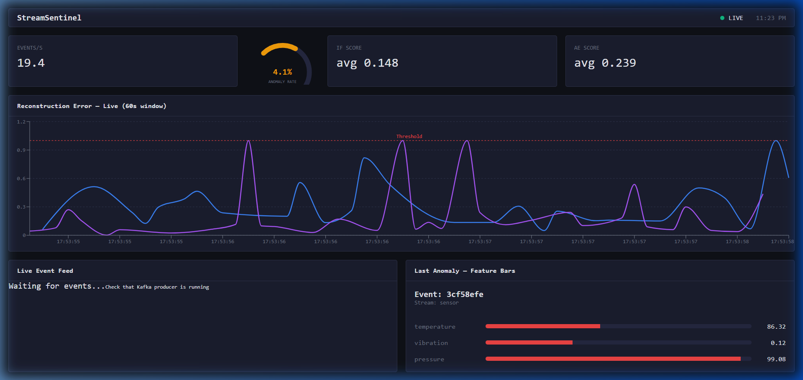

# 🛡️ StreamSentinel

<div align="center">
  <p><strong>A Real-Time Anomaly Detection System for High-Frequency Data Streams</strong></p>
  <p>
    <a href="#-architecture">Architecture</a> •
    <a href="#-features">Features</a> • 
    <a href="#-quick-start">Quick Start</a> •
    <a href="#-evaluation-results">Evaluation Results</a> •
    <a href="#-design-decisions">Design Decisions</a>
  </p>
</div>

---

**StreamSentinel** is an end-to-end, real-time anomaly detection platform. It ingests high-frequency synthetic events, scores them via a hybrid ML approach (Isolation Forest + PyTorch Autoencoder), and visualizes anomalies live on a real-time dashboard.

Built as a demonstration of production-grade ML engineering, it showcases how to bridge the gap between batch-trained models and real-time streaming inference.

## 🚀 Architecture

```text
Synthetic Producer (Python)
        │
        │  JSON over Kafka topics (3 partitions each)
        ▼
Apache Kafka (KRaft mode)
        │
        │  Consumer Group: anomaly-detectors-v1
        ▼
FastAPI Consumer Service
  ├── Kafka Consumer (aiokafka)
  ├── Preprocessor (StandardScaler)
  ├── Isolation Forest (sklearn)
  ├── Autoencoder (PyTorch)
  ├── Score Fusion Layer (weighted IF+AE)
  ├── SQLite Writer (anomalies only)
  └── WebSocket Manager
        │
        │  WebSocket (ws://)
        ▼
React Dashboard (Vite, Recharts, Pure CSS)
```



## ✨ Features

- **Real-Time Scoring Pipeline**: Fuses Scikit-learn **Isolation Forest** (contamination scoring) and PyTorch **Autoencoder** (reconstruction error) into a weighted confidence threshold.
- **WebSocket Broadcast**: Scored events are broadcast directly to a React frontend instantly with automatic reconnection.
- **Graceful Error Handling**: Robust Kafka consumer loop with `try/except` per message — a single bad event never kills the loop. At-least-once delivery with offset commit strictly after DB write.
- **Anomaly Gauge**: Live SVG gauge showing anomaly rate, color-coded green/yellow/red.
- **Explainability**: Feature deviation analysis calculated and shown on the dashboard for immediate anomaly context.
- **3-Partition Topics**: Kafka topics created with 3 partitions for parallelism via `kafka-init` service.

## 🛠️ Prerequisites

- **Docker & Docker Compose** (Ensure Docker Desktop is running)
- **Python 3.11+** (For offline model training)

## 🏃‍♂️ Quick Start

### Step 1 — Train models locally (one-time setup)

```bash
pip install -r scripts/requirements.txt
python scripts/generate_training_data.py
python scripts/train_isolation_forest.py
python scripts/train_autoencoder.py
python scripts/evaluate_models.py
```

All gates must pass before continuing.

### Step 2 — Start the stack

```bash
docker-compose up -d
```

### Step 3 — Create Kafka topics (required after every fresh start)

```bash
docker exec streamsentinel-kafka kafka-topics --bootstrap-server localhost:9092 \
  --create --if-not-exists --topic sensor-events --partitions 3 --replication-factor 1
docker exec streamsentinel-kafka kafka-topics --bootstrap-server localhost:9092 \
  --create --if-not-exists --topic financial-events --partitions 3 --replication-factor 1
```

### Step 4 — Access

| Service    | URL                              |
|------------|----------------------------------|
| Dashboard  | http://localhost:80              |
| API Health | http://localhost:8000/api/health |
| API Metrics| http://localhost:8000/api/metrics|
| Kafka UI   | http://localhost:8080            |

## 🧠 Model Training (Offline)

The models provided in `models/` are pre-trained on synthetic data. To re-train from scratch:

```bash
pip install -r scripts/requirements.txt
python scripts/generate_training_data.py   # generates data/*.parquet
python scripts/train_isolation_forest.py   # saves models/if_*.joblib
python scripts/train_autoencoder.py        # saves models/ae_*.pth
python scripts/evaluate_models.py          # must print ALL GATES PASSED
```

## 📊 Evaluation Results

Evaluated on 2,500 labeled synthetic events per stream (5% injected anomalies: point, contextual, and collective types). Fusion threshold: 0.65.

| Stream    | ROC-AUC | F1     | Precision | Recall |
|-----------|---------|--------|-----------|--------|
| Sensor    | 0.9952  | 0.8392 | 0.73      | 0.99   |
| Financial | 0.9893  | 0.7407 | 0.59      | 0.99   |

High recall (0.99) reflects deliberate threshold tuning to minimize missed anomalies. In fraud and safety monitoring, a false negative (missed real anomaly) is costlier than a false positive. Threshold 0.45 was tested and rejected: F1 dropped to 0.46–0.56.

**Latency Note:** True end-to-end latency (Producer → Kafka → Inference → SQLite → WebSocket → UI) has not been rigorously benchmarked under sustained load. The internal, synchronous ML inference step routinely measures a p95 of `< 10ms` (captured as a transient 50-second rolling window at 20 EPS), but this represents only a slice of the pipeline and should not be cited as the full system latency.

## ⚙️ Configuration

Control system behavior via the `.env` file at the root of the project:

```env
EVENTS_PER_SECOND=20
FUSION_THRESHOLD=0.65
IF_WEIGHT=0.6
AE_WEIGHT=0.4
```

## 🧩 Design Decisions

**Why Kafka over Redis Streams?**
Kafka's append-only log enables consumer group offset tracking, partition-based parallelism (3 partitions per topic), and durable replay — critical for audit trails in fraud detection. Redis Streams lacks the retention and replay semantics needed for production anomaly pipelines.

**Why Isolation Forest + Autoencoder fusion?**
Isolation Forest detects global point anomalies (features far from all clusters). The Autoencoder detects contextual anomalies (individually normal values in impossible combinations). They disagree on contextual anomalies — IF gives low score (values in range), AE gives high error (combination unseen in training). Fusion weight: IF=0.6, AE=0.4. Configurable via environment variables.

**Delivery semantics**
At-least-once delivery: Kafka offset is committed strictly after DB write. If the service crashes between scoring and commit, the event reprocesses. Idempotency is guaranteed by the UNIQUE constraint on `event_id` in SQLite.

**Why KRaft mode for Kafka?**
KRaft (no ZooKeeper) reduces the container count by 1, simplifies the startup dependency chain, and is the direction Kafka has been heading since 3.x. Fewer moving parts = faster CI and easier local development.

---

*Developed by [Nikhil Sharma](https://github.com/Nikhilsh10)*
